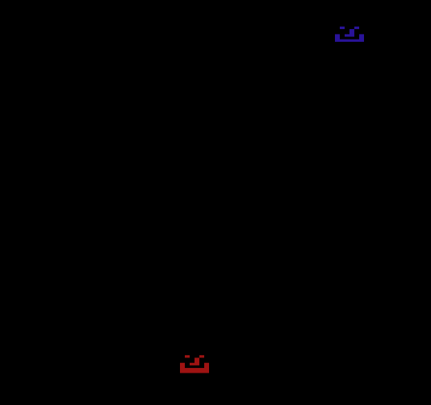

# UltimateTagDeathmatch

Description:

This is a simple game of tag between a player and a cpu player for the Atari 2600.

The Atari 2600 uses the 6507 which is very similar to the 6502.

It only has 128 bytes of RAM and 4K of ROM making it quite the programming challenge.

The player starts out as "it" and if there is a trigger collision between the players then the player who is "it" switches.

The cpu as very basic AI that will try to run away from the player while they are it but chase after them if they are not it.

How to run:

The binary is assembled using DASM which supports 6507 and 6502 instructions. The assembled binary is already include in this repo as ultimatetagdeathmatch.bin.

This binary can be run using the Stella emulator or any other Atari 2600 emulator.

